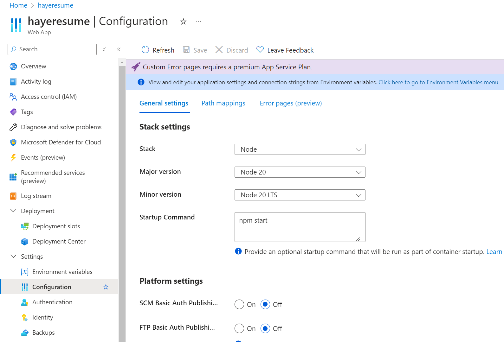

# Intro for current directory structure

1) `api` is for express.js backend script to handle api calls.
2) `plainClient` is a draft with core functionalities in vanilla JavaScript framework.
3) `react-clent` is react app frontend that integrated plain draft, which handles interaction for user login/signup and management.

# Key points of successful Zip deployment on Azure App service Web App with Cosmos DB for MongoDB API:
1) Environment variables configuration

2) Sartup Command configuration

3) ZIP deploment via Azure CLI
   - Command:
     ``` 
     az webapp deploy --resource-group hayeresume --name hayeresume --src-path ./hayeresume.zip 
     ```
   - Log:
     ```
     Deployment type: zip. To override deployment type, please specify the --type parameter. Possible values: war, jar, ear, zip, startup, script, static
     Initiating deployment
     Deploying from local path: ./hayeresume.zip
     Polling the status of sync deployment. Start Time: 2025-01-09 13:25:00.307508+00:00 UTC
     Status: Build successful. Time: 7(s)
     Status: Starting the site... Time: 22(s)
     Status: Starting the site... Time: 38(s)
     Status: Site started successfully. Time: 53(s)
     Deployment has completed successfully
     You can visit your app at: http://hayeresume-gxcxbgb0a2esh8cb.canadacentral-01.azurewebsites.net
     {
     "id": "/subscriptions/002cec98-3154-47cb-9394-7ed04aa682db/resourceGroups/hayeresume/providers/Microsoft.Web/sites/hayeresume/deploymentStatus/6279c297-8908-4e02-8893-23c7cb841f5b",
     "location": "Canada Central",
     "name": "6279c297-8908-4e02-8893-23c7cb841f5b",
     "properties": {
     "deploymentId": "6279c297-8908-4e02-8893-23c7cb841f5b",
     "errors": null,
     "failedInstancesLogs": null,
     "numberOfInstancesFailed": 0,
     "numberOfInstancesInProgress": 0,
     "numberOfInstancesSuccessful": 1,
     "status": "RuntimeSuccessful"
     },
     "resourceGroup": "hayeresume",
     "tags": {},
     "type": "Microsoft.Web/sites/deploymentStatus"
     }
     ```

# Domain of deployment on Azure
[Visit Hayeresume](https://hayeresume-gxcxbgb0a2esh8cb.canadacentral-01.azurewebsites.net/)


# How to build and deploy
1) navigate to `/react-client` and then run `npm run build`. There should be `hayeresume.zip` under path `~/api/`
2) navigate to `/api` and then run `npm run deployaz`